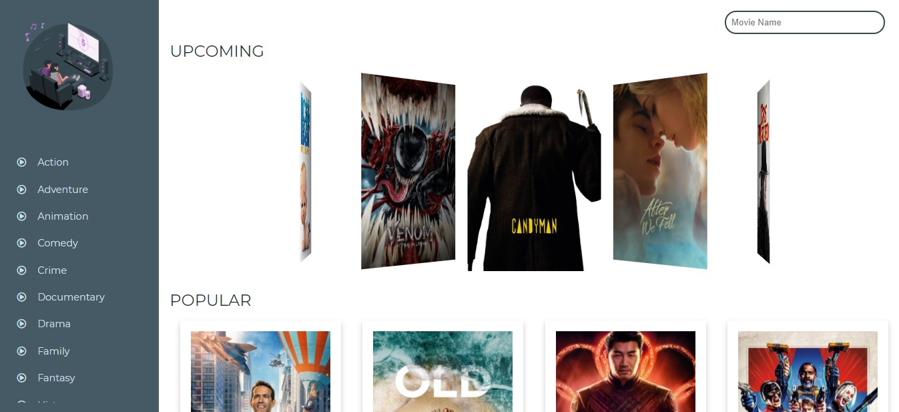

# Movie Search App

### Tools

- [React.js](https://reactjs.org/)
- [React-flippy](https://react-flippy.vercel.app/)
- [Swiper.js](https://swiperjs.com/react)

### Development

Catalog of movies and TV series made in React consuming TheMovieDB API. This project includes the functionality to filter the movies or season in which the user can also select the genre of the movie. Trailers of the available movies are linked to youtube and are opened via a popup video viewer without leaving the webpage. Creating Animations and slider has been a breeze thanks to javascript libraries like swiper.js.
